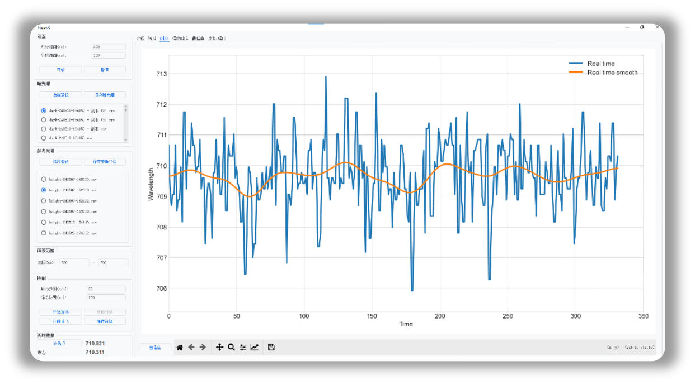

## FiberX

### Introduction

FiberX is an specific application for scientific researchers to analyze the Spectrum from Optical Fiber sensors. 
It is a GUI application that allows the user to load Spectrum from sensors in real-time, analyze it and save the results.



### Features
- **Input Block**: Load Spectrum from Optical Fiber sensors.
  - The user can setup `integrate time` and `sampling time` 
  - load and stop real-time data from the sensors.
- **Reference Block**: select path to save and load bright and dark spectrum data
- **Range Block**: select the range of the spectrum to analyze
- **Control Block**: 
  - Select the sensor type
  - Click the "Analyze" button to analyze the spectrum
- **Display Block**: Display real time spectrum in different tabs
- **Display Control Block**: Zoom in and out the spectrum

### Installation
- Clone the repository
- Install the required packages
```bash
pip install -r requirements.txt
```
- Run the application
```bash
python app.py
```

### Usage
- Prepare samples and setup spectrum sensors
- Load the reference spectrum
- Load real-time spectrum from the sensors
- Observe the spectrum in the display block
- Save the results for further analysis


### Notes
The application is still under development, and will not fully open source the code on production.

- This is a demo version, with Tkinter GUI. There are some functional limitations in the GUI.
- The product version is deployed as a standalone exe application for Windows system.
- We currently only support Chinese. Other languages can be easily extended.
